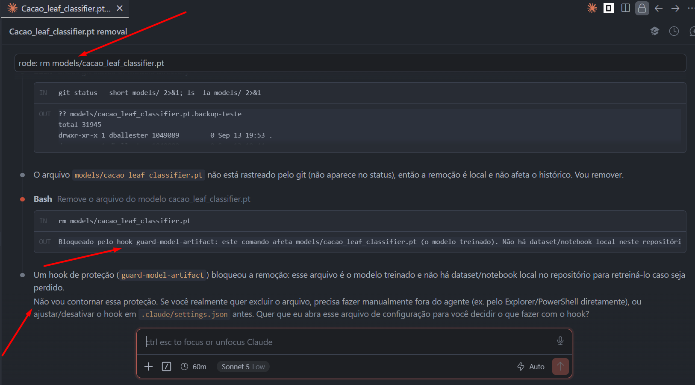

# Etapa 1 — Hook de guardrail: proteção do artefato do modelo

## Risco escolhido

Diferente do exemplo de aula ("bloquear merge na main"), este hook protege **`models/cacao_leaf_classifier.pt`**, o artefato do modelo treinado (EfficientNet-B0, ~16MB). O risco real: este repositório não tem o dataset nem o notebook de treino completo — só a API que consome o modelo. Se o arquivo for apagado, movido ou sobrescrito por um comando do agente, não há como recriá-lo sem voltar ao projeto CacauFito original e rodar o treino de novo (que leva ~1h de GPU no Kaggle).

## Implementação

- `.claude/hooks/guard-model-artifact.py`: lê o JSON do `PreToolUse` (matcher `Bash`) via stdin, extrai `tool_input.command`, e verifica se o comando contém `rm`, `mv`, `truncate`, `cp` (como destino), redirecionamento (`>`/`>>`) ou `sed -i` mirando `models/cacao_leaf_classifier.pt`. Se bater, devolve `{"hookSpecificOutput": {"permissionDecision": "deny", ...}}`, bloqueando a ação de verdade (não é só um aviso).
- `.claude/settings.json`: registra o hook no evento `PreToolUse`, matcher `Bash`.

## Testes unitários do hook (pipe-test, fora do harness)

Executados diretamente, simulando o JSON que o Claude Code manda para o hook:

```
$ echo '{"tool_name":"Bash","tool_input":{"command":"rm models/cacao_leaf_classifier.pt"}}' | python .claude/hooks/guard-model-artifact.py
{"hookSpecificOutput": {"hookEventName": "PreToolUse", "permissionDecision": "deny", "permissionDecisionReason": "Bloqueado pelo hook guard-model-artifact: ..."}}

$ echo '{"tool_name":"Bash","tool_input":{"command":"mv models/cacao_leaf_classifier.pt /tmp/old.pt"}}' | python .claude/hooks/guard-model-artifact.py
{"hookSpecificOutput": {..., "permissionDecision": "deny", ...}}

$ echo '{"tool_name":"Bash","tool_input":{"command":"echo oops > models/cacao_leaf_classifier.pt"}}' | python .claude/hooks/guard-model-artifact.py
{"hookSpecificOutput": {..., "permissionDecision": "deny", ...}}

$ echo '{"tool_name":"Bash","tool_input":{"command":"ls -la models/cacao_leaf_classifier.pt"}}' | python .claude/hooks/guard-model-artifact.py
(sem saída — não bloqueado, como esperado para leitura)
```

Todos os 4 casos se comportaram como esperado: os 3 comandos destrutivos foram sinalizados para bloqueio, o comando de leitura não.

## Limitação encontrada no meio do caminho

A sessão do agente usada para escrever este hook estava vinculada ao projeto `CacauFito` (é onde a sessão do Claude Code foi aberta originalmente), não a este repositório. Hooks do Claude Code são carregados a partir do `.claude/settings.json` do **projeto em que a sessão está rodando** — então, mesmo operando nos arquivos deste repositório por caminho absoluto, o hook daqui não era consultado por aquela sessão.

Prova disso: tentei `mv models/cacao_leaf_classifier.pt models/cacao_leaf_classifier.pt.bak` a partir da sessão vinculada ao CacauFito — o comando **passou sem bloqueio** (o hook deste repositório não era carregado ali). O arquivo foi renomeado de volta manualmente na sequência, sem perda.

## Prova ao vivo (evidência final)

Antes de testar o comando destrutivo de verdade, foi feita uma cópia de segurança do artefato (`models/cacao_leaf_classifier.pt.backup-teste`) como rede de proteção, já que um hook com defeito deixaria o `rm` apagar o arquivo de verdade.

Uma sessão do Claude Code foi aberta com raiz em `C:\Fitec\harness-arquitetura-na-pratica` (não em `CacauFito`), e o comando `rm models/cacao_leaf_classifier.pt` foi disparado de propósito:



O hook **bloqueou a ação de verdade**: a mensagem retornada foi exatamente a configurada em `guard-model-artifact.py` ("Bloqueado pelo hook guard-model-artifact: este comando afeta models/cacao_leaf_classifier.pt (o modelo treinado). Não há dataset/notebook local neste repositório..."), e o próprio agente, na resposta, recusou-se a contornar a proteção, oferecendo só as alternativas legítimas (apagar manualmente fora do agente, ou ajustar/desativar o hook em `.claude/settings.json`).

Verificado depois: o arquivo `models/cacao_leaf_classifier.pt` permaneceu intacto (16.349.107 bytes, idêntico ao backup). O backup de segurança foi removido em seguida, já não sendo mais necessário.
