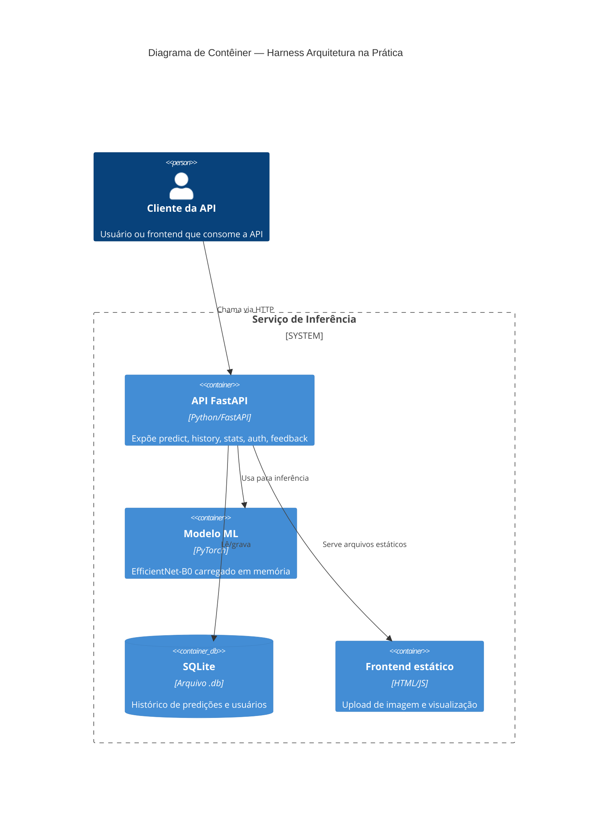
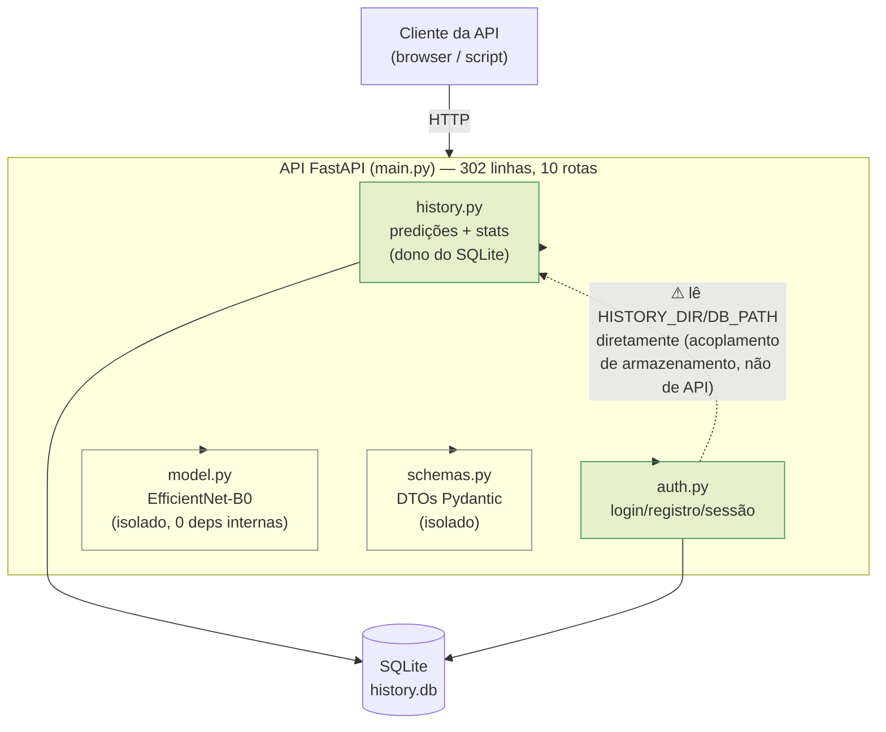

# Etapa 5 — Diagrama de arquitetura (duas versões)

## Versão 1 — prompt simples ("gere um diagrama C4 de contêiner da arquitetura atual")

**O que essa versão comunica bem**: a visão de alto nível de "quem fala com quem" e que existe um único serviço com 4 contêineres lógicos. Boa para alguém de fora do time entender o sistema em 10 segundos.

**O que ela não comunica**: não mostra os módulos internos da API (`main`, `auth`, `history`, `model`, `schemas`) nem o ponto de acoplamento real identificado na Etapa 4 (auth acessando o armazenamento de history diretamente). Para quem já conhece o sistema e quer decidir sobre refatoração, essa versão é rasa demais.

## Versão 2 — prompt com mais contexto (alimentado com o resultado real da Etapa 4) + ajuste manual

**O que mudou**: pedi o diagrama de novo citando explicitamente os dois pontos de acoplamento da Etapa 4 (o "controlador gordo" e o acesso direto de `auth` ao armazenamento de `history`) e ajustei manualmente o resultado gerado para: (a) mostrar os módulos internos da API, não só a caixa "API" genérica; (b) destacar visualmente (linha tracejada + aviso) a aresta problemática `auth → history` que motivou a decisão do ADR 0001; (c) anotar tamanho/isolamento de cada módulo, que é exatamente o dado usado na decisão arquitetural.

**Comparação — qual comunica melhor**: para uma visão gerencial ou de onboarding rápido, a **Versão 1** (C4 clássico) é melhor: menos elementos, mensagem clara em poucos segundos. Para justificar e documentar a decisão arquitetural desta atividade (ADR 0001), a **Versão 2** comunica muito melhor, porque o próprio diagrama já aponta o problema que motivou a decisão — sem ele, o leitor do ADR precisaria confiar só no texto. A lição prática: o nível de detalhe certo do diagrama depende de para quem e para quê ele é feito; um diagrama "correto" genérico não necessariamente serve ao propósito de documentar uma decisão específica.
